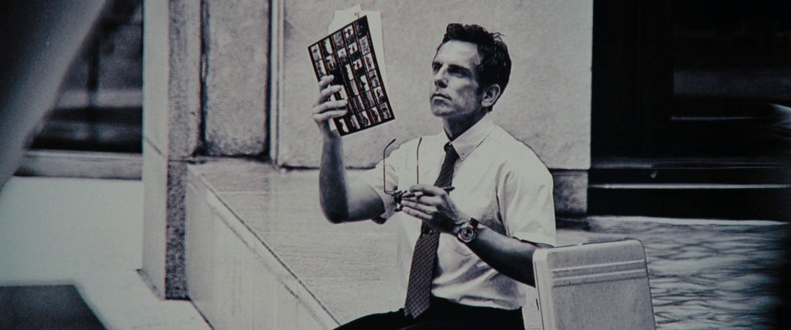

# Trace Draw

  

A minimalist, mobile-friendly web application designed for tracing images from a phone screen to paper.

**Live Link:** [https://haleelsada.github.io/trace-draw/](https://haleelsada.github.io/trace-draw/)

## Features
- **Zero Server Storage:** Images are processed locally in your browser.
- **Lock Mode:** Disable all touch interactions once your image is positioned, so you can rest your hand on the screen while tracing.
- **Zoom & Pan:** Precise controls for positioning your reference image.
- **Contrast & Grayscale:** Enhance lines and remove distracting colors for a better tracing experience.
- **Auto-Hiding UI:** Controls vanish during tracing to give you a clear view.

## Implementation Details
- **Framework:** React with TypeScript and Vite.
- **Styling:** Custom Vanilla CSS for a lightweight, zero-dependency minimalist UI.
- **Interactions:** Uses Pointer Events API for unified mouse and touch handling.
- **Filters:** Real-time image processing using CSS `filter` property (contrast/grayscale).
- **Deployment:** Automated via GitHub Actions to GitHub Pages.

## How to use
1. Upload an image.
2. Zoom and drag it into position.
3. (Optional) Adjust contrast or toggle B/W mode to make lines clearer.
4. Press **Lock**.
5. Place your paper over the screen and start tracing!
